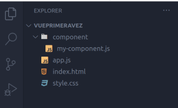
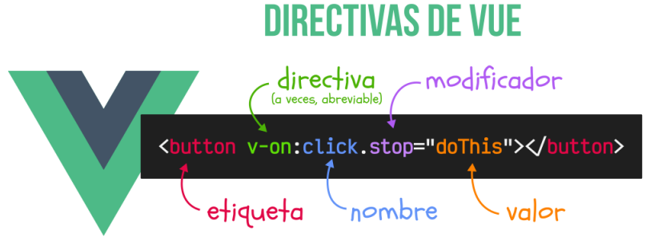
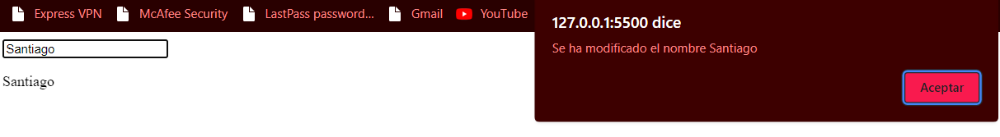

# Vue
Vue.js es un framework de JavaScript de código abierto para la construcción de interfaces de usuario y aplicaciones de una sola página. es un framework progresivo para construir interfaces de usuario
## Instalacion
1. Para este proceso es recomendable tener las bases de javaScript y el tema de módulos claros, realizaremos la instalación por medio la URL de CDN que nos ofrece la documentación oficial de vue.js, creamos la siguiente configuración básica para ello

2. En el archivo index.html, realizaremos la estructura básica de html y vinculamos el archivo app.js, en el body creamos un div 
```html
<!DOCTYPE html>
<html lang="en">
<head>
    <meta charset="UTF-8">
    <meta name="viewport" content="width=device-width, initial-scale=1.0">
    <title>Vue</title>
    <script src="app.js" type="module"></script>
</head>
<body>
    <div id="app">{{ mesagge }}</div>
</body>
</html>
```
3. Creamos nuestro componente
```js
//mi-component.js
export default {
    data() {
        return {    
            mensaje: "Hello World"
        }
    }
}
```
4. Lo importamos en el app.js
```js
//app.js
import { createApp } from "https://unpkg.com/vue@3/dist/vue.esm-browser.js";
import myComponent from "./component/my-component.js";

createApp(myComponent).mount('#app');
//El metodo .mount() hace la seleccion de div para la interpolación con vue
```
## Interpolacion y directivas

Cuando se trata de mostrar los datos del modelo a la vista, hablamos de interpolación. La interpolación más básica en Vue.js es usar "bigotes", es decir, pares de llaves con una expresión JavaScript para el contenido textual en su DOM.
Las directivas de Vue son atributos especiales que se colocan en las etiquetas HTML y están prefijados por v-, como por ejemplo, v-for, v-bind o v-on, entre muchas otras. Estas directivas permiten realizar acciones dinámicas potentes (bucles, condicionales,
etc...) que no se pueden realizar en HTML por sí solo,
Dichas directivas están formadas por varias partes:
- Directiva: El nombre de la directiva, que a veces, es posible abreviarlo con un carácter.
- Argumento: En ciertas directivas se indica un parámetro.
- Modificador: En ciertas directivas se puede modificar el comportamiento.
- Valor: En ciertas directivas,se requiere establecer un valor. Se escribe como el valor de un atributo HTML.
### Tipos de directivas:
#### Directivas basicas
- v-text
- v-html
- v-model
Estan permiten realizar tareas simples
#### Directivas condicionales
- v-show
- v-if
- v-else
- v-else-if
Estas permiten realizar acciones según condiciones
#### Directivas de bucles
- v-for
Esta permite realizar operaciones varias veces
#### Directivas avanzadas
- v-bind
- v-on
- v-slot
Estas permiten realizar tareas mas especificas
### v-text
Vue nos permite hacer referencia a las variables (o métodos, propiedades computadas, etc...) simplemente escribiendo entre {{ dobles llaves }}, lo que se conoce como sintaxis de plantillas o formato mustache, en referencia a uno de los primeros sistemas de plantillas de Javascript:
```js
//my-component.js
export default {
    data() {
        return {
            basico: "Apolo",
            intermedio: "Artemis",
            avanzado: "Sputnik"
        }
    }
}
```
```html
<!DOCTYPE html>
<html lang="en">
<head>
    <meta charset="UTF-8">
    <meta name="viewport" content="width=device-width, initial-scale=1.0">
    <title>Vue</title>
    <script src="app.js" type="module"></script>
</head>
<body>
    <div id="app">
        <h1 v-text="avanzado"></h1>
        <h2 v-text="intermedio"></h2>
        <h3 v-text="basico"></h3>
    </div>
</body>
</html>
```
### v-html
Si quisiéramos incluir código HTML en una de esas variables, se mostrarían las etiquetas literalmente. La directiva v-html funciona exactamente igual que v-text, solo que en lugar de mostrar las etiquetas, las procesa y renderiza.
```js
//my-component.js
export default {
    data() {
        return {
            basico: `<strong style="color:green">Apolo</strong>`,
            intermedio: `<strong style="color:red">Artemis</strong>`,
            avanzado: `<strong style="color:blue">Sputnik</strong>`
        }
    }
}
```
```html
<!DOCTYPE html>
<html lang="en">
<head>
    <meta charset="UTF-8">
    <meta name="viewport" content="width=device-width, initial-scale=1.0">
    <title>Vue</title>
    <script src="app.js" type="module"></script>
</head>
<body>
    <div id="app">
        <h1 v-html="avanzado"></h1>
        <h2 v-html="intermedio"></h2>
        <h3 v-html="basico"></h3>
    </div>
</body>
</html>
```
### v-model
Una de las directivas básicas más interesantes es v-model. Esta directiva permite crear un modelo de datos bidireccional entre un elemento HTML concreto y una variable de Vue. ¿Qué significa esto? Significa que podemos sincronizar el contenido de una variable con el contenido que tenga un elemento HTML <input> (por ejemplo) en su atributo value.
```js
//my-component.js
export default{
    data(){
        return {
            mensaje: "lorem"
        }
    }
}
```
```html
<!DOCTYPE html>
<html lang="en">
<head>
    <meta charset="UTF-8">
    <meta name="viewport" content="width=device-width, initial-scale=1.0">
    <title>Vue</title>
    <script src="app.js" type="module"></script>
</head>
<body>
    <div id="app">
        <input type="text" v-moddel.lazy="mensaje">
        <p v-text=""></p>
    </div>
</body>
</html>
```
En este ejemplo podemos ver como los datos cambian dependiendo de el contenido de el input.
Nota:La directiva v-model enlaza el valor de una variable con un `<input>`, `<select>`, `<textarea>` o un componente.

### lazy
Este modificador retrasa la actualización de la propiedad vinculada hasta que se dispara el evento change en lugar del evento input. Esto es útil cuando se desea evitar que una entrada de usuario genere demasiadas actualizaciones de la vista previa
```js
//my-component.js
export default{
    data(){
        return {
            nombre: null
        }
    },
    watch: {
        nombre() {
            alert(`Se ha modificado el nombre ${this.nombre}`);
        }
    }
}
```
```html
<!DOCTYPE html>
<html lang="en">
<head>
    <meta charset="UTF-8">
    <meta name="viewport" content="width=device-width, initial-scale=1.0">
    <title>Vue</title>
    <script src="app.js" type="module"></script>
</head>
<body>
    <div id="app">
        <input type="text" v-model.lazy="nombre">
        <p v-text="nombre"></p>
    </div>
</body>
</html>
```

Nota:La directiva v-model.lazy retrase hasta que se produzca un evento de cambio (por ejemplo, cuando se pulsa la tecla Enter o salgas del focus del input).